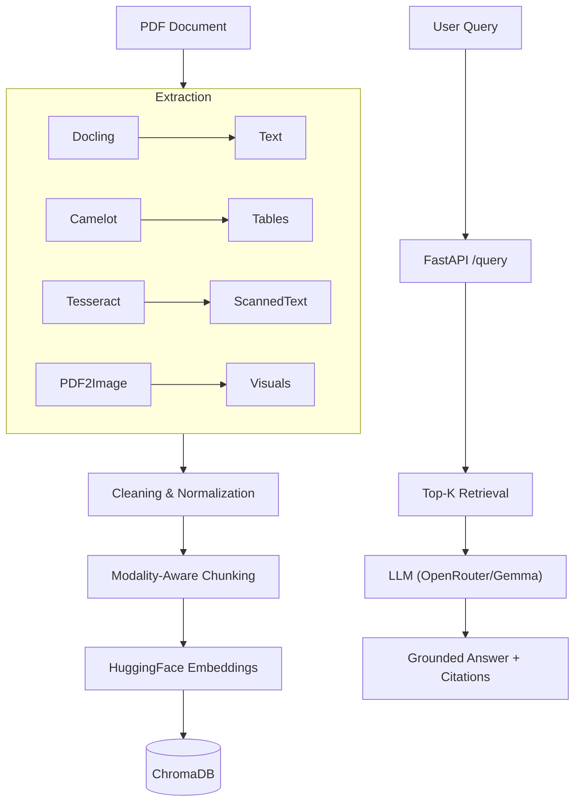

# 📄 Industrial Document Multimodal-RAG

**Text • Tables • OCR • Citation-Grounded Answers**

## 🔍 Overview

**industrial-document-multimodal-rag** is a production-grade multimodal Retrieval-Augmented Generation (RAG) pipeline designed to handle complex PDFs containing tables, scanned text, and images. It accurately retrieves and answers questions by processing various modalities separately and preserving their context, preventing hallucinations common in standard RAG systems.

## 🚀 Quick Start

### 1. Installation

```bash
# Clone the repository
git clone https://github.com/shax752003/industrial-document-multimodal-rag.git
cd industrial-document-multimodal-rag

# Install dependencies
pip install -r requirements.txt
```

### 2. Configuration

Create a `.env` file from the example and add your OpenRouter API Key:

```bash
cp .env.example .env
# Edit .env and add OPENROUTER_API_KEY=your_key_here
```

### 3. Run the Pipeline

To process documents, extract data, chunk, and build the index:

```bash
python -m pipelines.run_all
```

### 4. Run the Application

You can run the application locally or via Docker.

**Local (FastAPI):**

```bash
uvicorn app.api:app --reload
```
The API will be available at `http://localhost:8000`.

**Docker:**

```bash
docker-compose up --build
```

---

## 🏗️ Architecture



## 📁 Project Structure

```text
industrial-document-multimodal-rag/
│
├── app/                  # Application Logic
│   ├── api.py            # FastAPI Endpoints
│   ├── config.py         # Centralized configuration & environment variables
│   ├── rag.py            # RAG pipeline & LLM interaction
│   ├── retrieval.py      # Vector retrieval & deduplication logic
│   ├── embeddings.py     # Embedding model wrapper
│   ├── prompt.py         # Prompt engineering
│   └── utils.py          # Shared utilities (PDF helpers, file I/O)
│
├── pipelines/            # Data Processing Pipelines (1:1 with notebooks)
│   ├── ingest.py         # Metadata extraction
│   ├── extract.py        # Multimodal extraction (Text, Tables, OCR, Images)
│   ├── chunk.py          # Semantic & recursive chunking
│   ├── embed.py          # Vector embedding & indexing
│   └── run_all.py        # Pipeline orchestrator
│
├── notebook/             # Original Jupyter Notebooks
│   ├── 01_data_ingestion.ipynb
│   ├── 02_data_extraction.ipynb
│   ├── 03_chunking.ipynb
│   ├── 04_embedding_vectorstore.ipynb
│   └── 05_retrieval.ipynb
│
├── data/                 # Data Directory
│   ├── raw/              # Input PDFs
│   ├── extracted/        # Intermediate extracted artifacts
│   ├── chunks/           # Processed JSON chunks
│   └── chroma_db/        # Persisted VectorDB
│
├── vectorstore/          # Docker volume mount for VectorDB persistence
├── main.py               # Main Entry Point / Script
├── Dockerfile            # Docker image definition
├── docker-compose.yml    # Docker services definition
├── .env.example          # Environment variable template
├── requirements.txt      # Dependencies
└── README.md             # Documentation
```

## ⚙️ Tech Stack

- **Language**: Python
- **API Framework**: FastAPI
- **Containerization**: Docker, Docker Compose
- **LLM Framework**: LangChain
- **Vector Database**: ChromaDB
- **Embeddings**: HuggingFace (`all-MiniLM-L6-v2`)
- **LLM Provider**: OpenRouter (Gemma-3-27b / compatible models)
- **PDF Parsing**: Docling, PyMuPDF (Fitz)
- **Table Extraction**: Camelot
- **OCR**: Pytesseract / Tesseract
- **Visuals**: PDF2Image

## 🔌 API Endpoints

The FastAPI application exposes the following endpoints:

-   **`POST /query`**: Process a natural language query and return a RAG-generated answer with citations.
    ```json
    {
      "query": "What is the conclusion of the audit?"
    }
    ```
-   **`GET /health`**: Check the health status of the API.
-   **`GET /stats`**: Retrieval statistics about the vector store and chunks.

Documentation is available at `/docs` when the app is running (e.g., `http://localhost:8000/docs`).

## 🐳 Docker Deployment

To build and run the application in a containerized environment (ensuring reproducibility):

1.  **Build the Image**:
    ```bash
    docker build -t industrial-document-multimodal-rag .
    ```

2.  **Run with Docker Compose** (Recommended):
    ```bash
    docker-compose up
    ```
    This mounts the `data/` and `vectorstore/` directories to persist data and embeddings.

## 🔄 Pipeline Details

1.  **Ingestion (`pipelines/ingest.py`)**: Validates PDF mimetypes and extracts metadata.
2.  **Extraction (`pipelines/extract.py`)**:
    -   Extracts text via Docling.
    -   Extracts tables via Camelot (CSV).
    -   Extracts images via PyMuPDF (embedded) and PDF2Image (renders).
    -   Runs OCR on extracted images.
    -   *Idempotent*: Skips already processed files.
3.  **Chunking (`pipelines/chunk.py`)**:
    -   Recursive character splitting for text.
    -   Row-based chunking for tables.
4.  **Embedding (`pipelines/embed.py`)**:
    -   Embeds all chunks using Sentence Transformers.
    -   Indexes into ChromaDB.
    -   *Efficient*: Checks if index exists before rebuilding.

## 🤝 Contributing

1.  Fork the repo
2.  Create your feature branch (`git checkout -b feature/amazing-feature`)
3.  Commit your changes (`git commit -m 'Add some amazing feature'`)
4.  Push to the branch (`git push origin feature/amazing-feature`)
5.  Open a Pull Request
